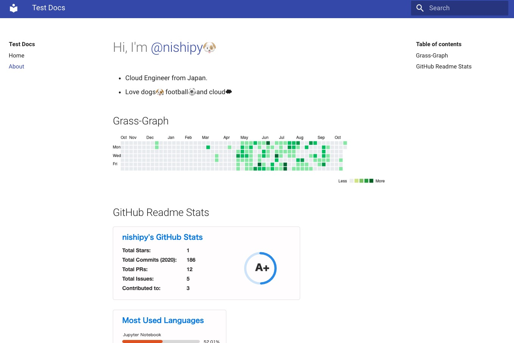
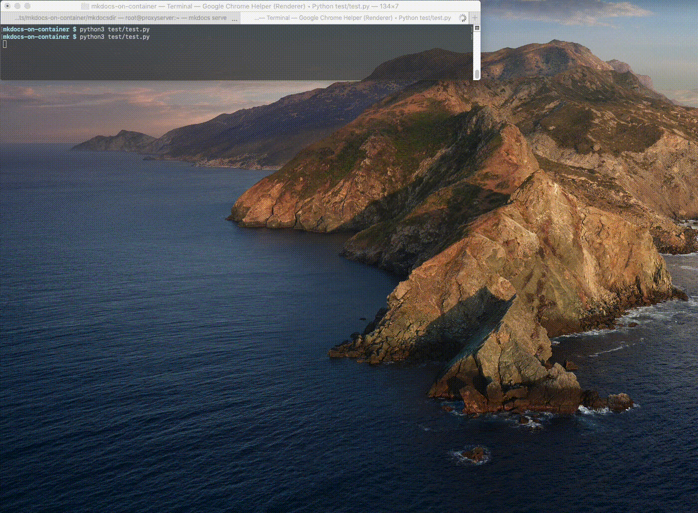

# Sample MkDocs on docker
## Build a image
```
docker build . -t mkdocs
```

## Use a image
```
docker run --name mkdocs -d -p 8000:8000 mkdocs
```
```
docker run --name mkdocs -d -p 8000:8000 -v $(pwd)/your-mkdocs-dir/:/workdir/ mkdocs
```

## See documentation on your browser
```
http://localhost:8000
```



## Testing
- Test by using curl.
  ```
  sh test/serve_test.sh 
  ```

- Test by using Selenium
  ```
  python test/test.py
  ```
  